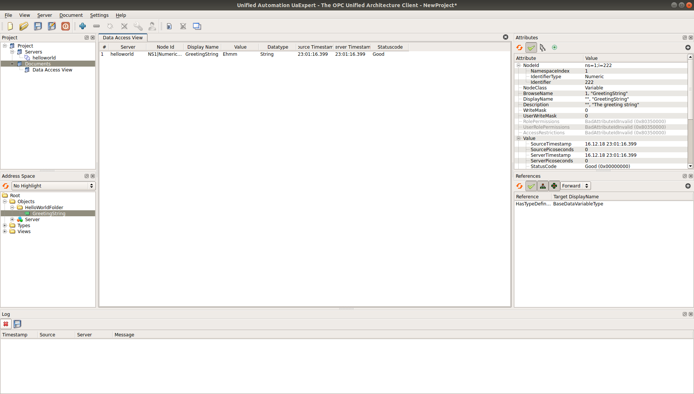

Hello, World of OPC UA!
===========================

This is the simplest example of an OPC UA application based on ASNeG OPC UA Stack.
The example will help you to understand the basic OPC UA conceptions and make your first OPC UA server.
Here we are going to output a greeting message which will be available from other OPC UA client.

Requirements
---------------------------

In order to start this tutorial you need to have the following stuff:

1. Windows or Linux machine with the installed stack (see :doc:`installation <installation>`  if you don't have it yet.)
2. A text editor
3. An OPC UA client to test the app. In the tutorial I will use `OPC UA Expert`_.

Creating the application frame
------------------------------
At first we need to create the frame of the future application. It is very easy to do with the stack.
Just type in your console:

::

    $ OpcUaProjectBuilder3 helloworld "My First OPC UA Application" 8888

The builder has created a C++ project in folder **helloworld**, which is ready
to be compiled and run as an OPC UA server on 8888 TCP\\IP port.

If you look inside the folder you can see quite many files, but don't worry.
You don't need to touch most of them. For our goal we need only two:

* **src/helloworld/Config/OpcUaServer.xml** - configuration of the server
* **src/helloworld/Library/Library.cpp** - source code of the user application

Information Model
---------------------------

Every OPC UA server application provides its data with :term:`Node`\ s, which
contain some information and have a tree structure. To make a greeting string
available for OPC UA clients we must to describe it as a node in
:term:`Information Model`. Let's do it!

Create a file with name **HelloWorldNodeSet.xml** in directory
**src/helloworld/Config** and copy there the following text in XML format:

.. code-block:: xml
  :emphasize-lines: 3,5

    <?xml version="1.0" encoding="utf-8"?>
    <UANodeSet xmlns:xsi="http://www.w3.org/2001/XMLSchema-instance" xmlns:uax="http://opcfoundation.org/UA/2008/02/Types.xsd" xmlns:xsd="http://www.w3.org/2001/XMLSchema" Version="1.02"          LastModified="2013-03-06T05:36:44.0862658Z" xmlns="http://opcfoundation.org/UA/2011/03/UANodeSet.xsd">
        <NamespaceUris>
            <Uri>http://localhost/helloworld/</Uri>
        </NamespaceUris>

        <UAObject NodeId="ns=1;i=1" BrowseName="1:HelloWorldFolder">
            <DisplayName>HelloWorldFolder</DisplayName>
            <Description>The folder of the greeting string</Description>
            <References>
                <Reference ReferenceType="Organizes" IsForward="false">i=85</Reference>
                <Reference ReferenceType="HasTypeDefinition">i=61</Reference>
            </References>
        </UAObject>

        <UAVariable NodeId="ns=1;i=222" BrowseName="1:GreetingString" DataType="i=12">
            <DisplayName>GreetingString</DisplayName>
            <Description>The greeting string</Description>
            <References>
                <Reference ReferenceType="HasTypeDefinition">i=63</Reference>
                <Reference ReferenceType="Organizes" IsForward="false">ns=1;i=1</Reference>
            </References>
	        <Value>
                <uax:String>Ehmm</uax:String>
            </Value>
        </UAVariable>
    </UANodeSet>

This file describes the structure of the application:

::

    Root
     |
     |- Objects
         |
         |-HelloWorldFolder
            |
            |- GreetingString (="Hello, World!")

Now we must include our node set to the information model of the application in
file **src/helloworld/Config/OpcUaServer.xml**:

.. code-block:: xml
  :emphasize-lines: 3

  <InformationModel>
    <NodeSetFile>@CONF_DIR@/Opc.Ua.NodeSet.xml</NodeSetFile>
    <NodeSetFile>@CONF_DIR@/HelloWorldNodeSet.xml</NodeSetFile>
  </InformationModel>

This might seem quite complicated, but actually you won't need to make your XML
node sets manually. You can use our `OPC UA Designer`_ to make this process easier.
However we do everything ourselves, so that we can learn some basic OPC UA
conceptions. If you are already familiar to the protocol, just skip the rest of the section.

OPC UA :term:`Information Model` is split into *namespaces*. Each of them must
have its *namespace index*. Index 0 is reserved for the OPC UA standard namespace,
where all standard types are described. In our application it is stored in
**Opc.Ua.NodeSet.xml**. The application can't work without it, so we need to
include this file in our configuration.

In **HelloWorldNodeSet.xml** we've described our own *namespace* by defining
*NamespaceUri*:

.. code-block:: xml
    :emphasize-lines: 2

    <NamespaceUris>
        <Uri>http://localhost/helloworld/</Uri>
    </NamespaceUris>

It is not necessary for our task that the URI is really exists, but the stack
needs it to give our *namespace* a new *namespace index* which will be 1.

Now we can describe folder **HelloWorldFolder** for our message:

.. code-block:: xml

    <UAObject NodeId="ns=1;i=1" BrowseName="1:HelloWorldFolder">
        <DisplayName>HelloWorldFolder</DisplayName>
        <Description>The folder of the greeting string</Description>
        <References>
            <Reference ReferenceType="Organizes" IsForward="false">i=85</Reference>
            <Reference ReferenceType="HasTypeDefinition">i=61</Reference>
        </References>
    </UAObject>

In the OPC UA everything (:term:`Object`\ s, :term:`Variable`\ s, :term:`ObjectType`\ s,
:term:`Method`\ s etc.) is :term:`Node`\ s and every :term:`Node` must be identified by
a unique *node ID*. Our **HelloWorldFolder** is an *object* with ID "ns=1;i=1",
that means it belongs to *namespace* 1 and has *identifier* 1.

The next important OPC UA conception is :term:`Reference`\ s, they describe
relationships between :term:`Node`\ s. In our case folder **HelloWorldFolder**
is placed on folder *Objects*. This relation is described by the following sting:

.. code-block:: xml

    <Reference ReferenceType="Organizes" IsForward="false">i=85</Reference>

The node ID 'i=85' belongs to standard node-folder *Objects* in namespace 0. You
can found it in **Opc.Ua.NodeSet.xml**.

In our application **HelloWorldFolder** is just a container for **GreetingString**
and it doesn't have any other information. In OPC UA the data is stored in
:term:`Variable`\ s. And our string is a :term:`Variable` as well:

.. code-block:: xml

    <UAVariable NodeId="ns=1;i=222" BrowseName="1:GreetingString" DataType="i=12">
        <DisplayName>GreetingString</DisplayName>
        <Description>The greeting string</Description>
        <References>
            <Reference ReferenceType="HasTypeDefinition">i=63</Reference>
            <Reference ReferenceType="Organizes" IsForward="false">ns=1;i=1</Reference>
        </References>
        <Value>
            <uax:String>Ehmm</uax:String>
        </Value>
    </UAVariable>

As you can see from the XML snippet, the main difference between :term:`Object`\ s
and :term:`Variable`\ s is, that the :term:`Variable`\ s have values. Variable
**GreatingString** has value of type string (ns=0,i=12) with default value *Ehmm*
and placed on **HelloWorldFolder** (ns=1;i=1)

Now our information model is described completely and we can see it with an
OPC UA client. But we need to compile and launch the application before.

Building and running
---------------------------

In order to make the build process easier ASNeG OPC UA Stack provides scripts
for building and installing user applications. We will build and install our
application locally:

On Linux:

::

    $ sh build.sh -t local -i path/to/install

On Windows:

::

	$ build.bat -t local -i path\to\install

The application will be built as a shared library and copied with its
configuration into the installation directory.

Now go to the directory where you have install the application and run the
following command:

On Linux:

::

    $ export LD_LIBRARY_PATH=$LD_LIBRARY_PATH:path/to/install/usr/lib/
    $ OpcUaServer3 ./etc/OpcUaStack/helloworld/OpcUaServer.xml

On Windows:

::

    $ set PATH=%PATH%;\path\to\insstall\usr\lib\
    $ OpcUaServer3 etc\OpcUaStack\helloworld\OpcUaServer.xml

We need to determine, where the shared library is, by using the environment
variable only when we install the app locally. You can build a DEB, RPM or MSI
packet to distribute our applications as services.

Testing with OPC UA Client
---------------------------

So far our application does nothing but we can see its structure in OPC UA client.
Make sure that the application is running and launch `OPC UA Expert`_. Click on
*Server->Add* and add the server with URI **opc.tcp://127.0.0.1:8888**. You
should see:

.. figure:: add_new_server.png
   :scale: 50 %
   :alt: add a new OPC UA server

Click on security policy **None** and connect to the server. Then drop node
*GreetingString* onto *Data Access View*. Now our should see the following view:

If you are new at OPC UA technology it could be very useful to take some time
discovering the application and comparing the information from the client
with **HelloWorldNodeSet.xml** and **HelloWorldNodeSet.xml** files.

Actually we've described the simplest way to connect with OPC UA server but there
are some other approaches too. See :ref:`discovery_process` and :ref:`security`
sections for more information.

Hello, World!
---------------------------

Now we can make our application do something "useful". Open file
**src/helloworld/Library/Library.cpp** and place the following code to method
**startup**:

.. code-block:: cpp

    bool
    Library::startup(void)
    {
        Log(Debug, "Library::startup");

        GetNodeReference getNodeReference(OpcUaNodeId(222,1));
        if (!getNodeReference.query(&this->service())) {
            Log(Error, "response error");
            return false;
        }

        if (getNodeReference.statuses()[0] != Success) {
            Log(Error, "node reference error");
            return false;
        }

        auto ptr = getNodeReference.nodeReferences()[0].lock();
        if (!ptr) {
            Log(Error, "node no longer exist");
            return false;
        }

        OpcUaDataValue dataValue(OpcUaString("Hello, world!"));
        ptr->setValueSync(dataValue);

        return true;
    }

There is a pretty big amount of code, but it is not so complicated as it looks.
The communication between a user application and the stack based on the
transaction model. So we need to send a request for getting a variable. Pay
attention that we use the same *node ID* of the greeting string that we've
described in **HelloWorldNodeSet.xml**.

.. code-block:: cpp

    GetNodeReference getNodeReference(OpcUaNodeId(222,1));
    if (!getNodeReference.query(&this->service())) {
        Log(Error, "response error");
        return false;
    }

After we've sent the request to the stack, we can check if the node is available
and get our greeting string as a :term:`Variable`:

.. code-block:: cpp

    if (getNodeReference.statuses()[0] != Success) {
        Log(Error, "node reference error");
        return false;
    }

    auto ptr = getNodeReference.nodeReferences()[0].lock();
    if (!ptr) {
        Log(Error, "node no longer exist");
        return false;
    }

The last step is to write new value "Hello, World!" into the string:

.. code-block:: cpp

    OpcUaDataValue dataValue(OpcUaString("Hello, world!"));
    ptr->setValueSync(dataValue);

OPC UA :term:`Variable`\ s contain not only values, but some additional information.
The *status code* provides information about the quality of the data. If it is
not **Success** the client can't trust the value of the variable. You can learn
more about how to obtain data with the stack in :ref:`data_access` section.

Now we can see the message with the client. Rebuild the application and connect
with the client to it.

References
---------------------------

* :ref:`installation`
* :ref:`discovery_process`
* :ref:`data_access`
* :ref:`security`
* `OPC UA Designer`_
* `OPC UA Expert`_

.. _OPC UA Expert: https://www.unified-automation.com/products/development-tools/uaexpert.html
.. _OPC UA Designer: https://github.com/ASNeG/OpcUaDesigner
