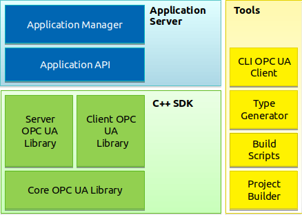
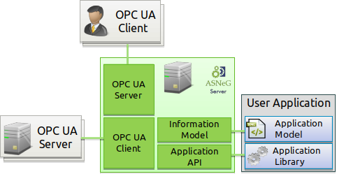
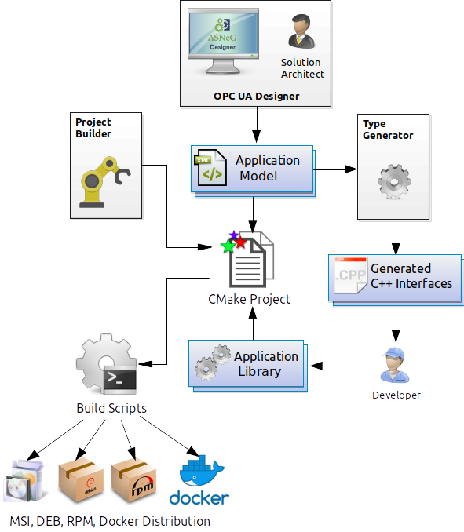

Overview
===========================

ASNeG OPC UA Stack is not only an open source implementation of OPC UA protocol in
C++. It is a framework that provides tools to create, develop, test and distribute
OPC UA applications.

Structure of ASNeG OPC UA Stack
---------------------------------

The stack contains the following components:

* C++ Client\\Server SDK
* Application Server
* Development Tools

   **OPC UA Stack Components**

**C++ Client\\Server SDK** is an implementation OPC UA client server in C++.
The SDK provides API to write your own OPC UA server and client applications and
you can use it without the rest of the stack.

**Application Server** provides an *Application API* which automates many of typical
for an OPC UA application operations. Moreover, it has an *Application Manager*. It loads
the user applications as shared libraries (.so, .dll) and runs them. You can learn more
about :ref:`below <application_server>`

**Development Tools** is a set of scripts and programs that automate creating,
building and distributing OPC UA applications.

*Project Builder* creates a template of a CMake project that contains everything to
start developing an application from scratch.

*Build Scripts* are scripts that build the created by *Project Builder* project and
package it into DEB, RPM or MSI packages for distribution. Also, the scripts provide standalone packaging,
when they include the whole stack with dependencies in the package so that the application
can run without the stack.

*Type Generator* generates C++ classes from OPC UA types described in XML Node Set
by *OPC UA Modeler*. With *Type Generator* users can describe their data as objects and implement the business
logic in C++. Then they can make instances of the types without registering their
variables in :ref:`Information Model`.

*CLI OPC UA Client* is a simple console program which you can use to test your application.

.. _application_server:

Application Server
------------------

Using **Application Server** a developer doesn't need to implement the communication
part of the OPC server and can focus on the business logic of the user application.

   **Application Server**

A user application contains an *Application Model* and an *Application Library*.

The *Application Model* describes in XML how the application data is available in :term:`Information Model`
for the OPC UA client. It contains information about types, :term:`Variable`\ s, :term:`Method`\ s and
:term:`Reference`\ s between the :term:`Node`\ s. The **Application Server** loads
the *Application Model* in the format specified by OPC UA Standard so that the developer
can write it by using `ASNeG OPC UA Designer`_ or any other GUI tools.

The *Application Library* implements the business logic of the user application
in C++. The **Application Server** provides an *Application API*. The user application
can use it to access to :term:`Information Model`, subscribe notifications about
the actions of the client (e.g., read\\write operations, authentication),
implement a :term:`Method`, fire an :term:`Event` and so on.

Since a user application is developed by using **C++ Client\\Server SDK**,
it can use its client part to exchange data with other OPC UA servers in the
network.

Development Process
-------------------

We have already describe the main components of the stack. In this section we'll
show how they are used to develop a user application.

   **Development Process**

At first we have to create a CMake project from a template with *Project Builder*.
The project has empty *Application Library*'s classes, configuration files and
*Build Scripts*.

The next step is creation of *Application Model* manually or with a
GUI tool (for example, `ASNeG OPC UA Designer`_). In *Application Model* we can
describe some domain specific types and generate C++ classes from it by using  *Type Generator*.

Then we implement the domain logic and build *Application Library* with
*Build Scripts*. The application can be installed locally or run in Docker container
to test and debug it.

Finally we can use *Build Scripts* to package our application into MSI, DEB or RPM
packages to distribute it on other machines.

.. _coverage:

OPC UA Specification Coverage
------------------------------

Before to use the stack in your project, pay attention to the OPC UA services which
the stack supports. If you doesn't find that you need in the tables below, feel free
to make an issue `on Github <https://github.com/ASNeG/OpcUaStack/issues>`_ and we'll
make our best to add it.

.. |done| unicode:: U+2713 .. DONE

**Client Library:**

+------------------------+----------------------------+---------+---------+---------+-------------+
|      Service Set       | Function                   | OPC UA Interface  | Value Based Interface |
+------------------------+----------------------------+---------+---------+---------+-------------+
|                        |                            | Sync    |  Async  | Sync    | Async       |
+========================+============================+=========+=========+=========+=============+
| Discover               | Find Server                |         |         |         |             |
+                        +----------------------------+---------+---------+---------+-------------+
|                        | Get Endpoints              | |done|  | |done|  |         |             |
+                        +----------------------------+---------+---------+---------+-------------+
|                        | Register Server            |         |         |         |             |
+------------------------+----------------------------+---------+---------+---------+-------------+
| Secure                 | Open Secure Channel        | |done|  | |done|  | |done|  | |done|      |
+                        +----------------------------+---------+---------+---------+-------------+
|                        | Close Secure Channel       | |done|  | |done|  | |done|  | |done|      |
+------------------------+----------------------------+---------+---------+---------+-------------+
| Session                | Create Session             | |done|  | |done|  | |done|  | |done|      |
+                        +----------------------------+---------+---------+---------+-------------+
|                        | Activate Session           | |done|  | |done|  | |done|  | |done|      |
+                        +----------------------------+---------+---------+---------+-------------+
|                        | Close Session              | |done|  | |done|  | |done|  | |done|      |
+                        +----------------------------+---------+---------+---------+-------------+
|                        | Cancel Session             | |done|  | |done|  |         |             |
+------------------------+----------------------------+---------+---------+---------+-------------+
| Node Management        | Add Nodes                  | |done|  | |done|  |         |             |
+                        +----------------------------+---------+---------+---------+-------------+
|                        | Add References             | |done|  | |done|  |         |             |
+                        +----------------------------+---------+---------+---------+-------------+
|                        | Delete Nodes               | |done|  | |done|  |         |             |
+                        +----------------------------+---------+---------+---------+-------------+
|                        | Delete References          | |done|  | |done|  |         |             |
+------------------------+----------------------------+---------+---------+---------+-------------+
| View                   | Browse                     | |done|  | |done|  |         |             |
+                        +----------------------------+---------+---------+---------+-------------+
|                        | Browse Next                | |done|  | |done|  |         |             |
+                        +----------------------------+---------+---------+---------+-------------+
|                        | Translate Browse Paths     | |done|  | |done|  |         |             |
+                        +----------------------------+---------+---------+---------+-------------+
|                        | Register Nodes             |         |         |         |             |
+                        +----------------------------+---------+---------+---------+-------------+
|                        | Unregister Nodes           |         |         |         |             |
+------------------------+----------------------------+---------+---------+---------+-------------+
| Query                  | Query First                | |done|  | |done|  |         |             |
+                        +----------------------------+---------+---------+---------+-------------+
|                        | Query Next                 | |done|  | |done|  |         |             |
+------------------------+----------------------------+---------+---------+---------+-------------+
| Attribute              | Read                       | |done|  | |done|  | |done|  | |done|      |
+                        +----------------------------+---------+---------+---------+-------------+
|                        | History Read               | |done|  | |done|  |         |             |
+                        +----------------------------+---------+---------+---------+-------------+
|                        | Write                      | |done|  | |done|  | |done|  | |done|      |
+                        +----------------------------+---------+---------+---------+-------------+
|                        | History Update             | |done|  | |done|  |         |             |
+------------------------+----------------------------+---------+---------+---------+-------------+
| Method                 | Call                       | |done|  | |done|  |         |             |
+------------------------+----------------------------+---------+---------+---------+-------------+
| Monitored Item         | Create Monitored Items     | |done|  | |done|  | |done|  | |done|      |
+                        +----------------------------+---------+---------+---------+-------------+
|                        | Modify Monitored Items     | |done|  | |done|  |         |             |
+                        +----------------------------+---------+---------+---------+-------------+
|                        | Set Monitoring Mode        | |done|  | |done|  |         |             |
+                        +----------------------------+---------+---------+---------+-------------+
|                        | Set Triggering             | |done|  | |done|  |         |             |
+                        +----------------------------+---------+---------+---------+-------------+
|                        | Delete Monitored Items     | |done|  | |done|  | |done|  | |done|      |
+------------------------+----------------------------+---------+---------+---------+-------------+
| Subscription           | Create Subscription        | |done|  | |done|  | |done|  | |done|      |
+                        +----------------------------+---------+---------+---------+-------------+
|                        | Modify Subscription        | |done|  | |done|  |         |             |
+                        +----------------------------+---------+---------+---------+-------------+
|                        | Publish/Set                | |done|  | |done|  | |done|  | |done|      |
+                        +----------------------------+---------+---------+---------+-------------+
|                        | Republish                  |         |         |         |             |
+                        +----------------------------+---------+---------+---------+-------------+
|                        | Transfer Subscription      |         |         |         |             |
+                        +----------------------------+---------+---------+---------+-------------+
|                        | Delete Subscription        | |done|  | |done|  | |done|  | |done|      |
+------------------------+----------------------------+---------+---------+---------+-------------+

Columns:

* *OPC UA Interface* contains the OPC UA interface with full functionality. To use the interface OPC UA skills are necessary
* *Value Based Interface* contains a value based interface with limited functionality. To use the interface OPC UA skills are not necessary

**Server Library:**

+------------------------+----------------------------+--------------+----------+---------+---------+-------------+
|      Service Set       | Function                   | Information  |  OPC UA Interface  | Value Based Interface |
|                        |                            | Model        |                    |                       |
+------------------------+----------------------------+--------------+----------+---------+---------+-------------+
|                        |                            |              |  Sync    |  Async  | Sync    | Async       |
+========================+============================+==============+==========+=========+=========+=============+
| Discover               | Find Server                |              |          |         |         |             |
+                        +----------------------------+--------------+----------+---------+---------+-------------+
|                        | Get Endpoints              | |done|       |          |         |         |             |
+                        +----------------------------+--------------+----------+---------+---------+-------------+
|                        | Register Server            |              |          |         |         |             |
+------------------------+----------------------------+--------------+----------+---------+---------+-------------+
| Secure                 | Open Secure Channel        | |done|       |          |         |         |             |
+                        +----------------------------+--------------+----------+---------+---------+-------------+
|                        | Close Secure Channel       | |done|       |          |         |         |             |
+------------------------+----------------------------+--------------+----------+---------+---------+-------------+
| Session                | Create Session             | |done|       |          |         |         |             |
+                        +----------------------------+--------------+----------+---------+---------+-------------+
|                        | Activate Session           | |done|       |          |         |         |             |
+                        +----------------------------+--------------+----------+---------+---------+-------------+
|                        | Close Session              | |done|       |          |         |         |             |
+                        +----------------------------+--------------+----------+---------+---------+-------------+
|                        | Cancel Session             |              |          |         |         |             |
+------------------------+----------------------------+--------------+----------+---------+---------+-------------+
| Node Management        | Add Nodes                  |              |          |         |         |             |
+                        +----------------------------+--------------+----------+---------+---------+-------------+
|                        | Add References             |              |          |         |         |             |
+                        +----------------------------+--------------+----------+---------+---------+-------------+
|                        | Delete Nodes               |              |          |         |         |             |
+                        +----------------------------+--------------+----------+---------+---------+-------------+
|                        | Delete References          |              |          |         |         |             |
+------------------------+----------------------------+--------------+----------+---------+---------+-------------+
| View                   | Browse                     | |done|       |          |         |         |             |
+                        +----------------------------+--------------+----------+---------+---------+-------------+
|                        | Browse Next                | |done|       |          |         |         |             |
+                        +----------------------------+--------------+----------+---------+---------+-------------+
|                        | Translate Browse Paths     |              |          |         |         |             |
+                        +----------------------------+--------------+----------+---------+---------+-------------+
|                        | Register Nodes             |              |          |         |         |             |
+                        +----------------------------+--------------+----------+---------+---------+-------------+
|                        | Unregister Nodes           |              |          |         |         |             |
+------------------------+----------------------------+--------------+----------+---------+---------+-------------+
| Query                  | Query First                |              |          |         |         |             |
+                        +----------------------------+--------------+----------+---------+---------+-------------+
|                        | Query Next                 |              |          |         |         |             |
+------------------------+----------------------------+--------------+----------+---------+---------+-------------+
| Attribute              | Read                       |  |done|      |  |done|  |         |         |             |
+                        +----------------------------+--------------+----------+---------+---------+-------------+
|                        | History Read               | |done|       |  |done|  |         |         |             |
+                        +----------------------------+--------------+----------+---------+---------+-------------+
|                        | Write                      | |done|       |  |done|  |         |         |             |
+                        +----------------------------+--------------+----------+---------+---------+-------------+
|                        | History Update             |              |          |         |         |             |
+------------------------+----------------------------+--------------+----------+---------+---------+-------------+
| Method                 | Call                       | |done|       |  |done|  |         |         |             |
+------------------------+----------------------------+--------------+----------+---------+---------+-------------+
| Monitored Item         | Create Monitored Items     | |done|       |  |done|  |         |         |             |
+                        +----------------------------+--------------+----------+---------+---------+-------------+
|                        | Modify Monitored Items     |              |          |         |         |             |
+                        +----------------------------+--------------+----------+---------+---------+-------------+
|                        | Set Monitoring Mode        |              |          |         |         |             |
+                        +----------------------------+--------------+----------+---------+---------+-------------+
|                        | Set Triggering             |              |          |         |         |             |
+                        +----------------------------+--------------+----------+---------+---------+-------------+
|                        | Delete Monitored Items     | |done|       | |done|   |         |         |             |
+------------------------+----------------------------+--------------+----------+---------+---------+-------------+
| Subscription           | Create Subscription        | |done|       |          |         |         |             |
+                        +----------------------------+--------------+----------+---------+---------+-------------+
|                        | Modify Subscription        |              |          |         |         |             |
+                        +----------------------------+--------------+----------+---------+---------+-------------+
|                        | Publish/Set                | |done|       |  |done|  |         |         |             |
+                        +----------------------------+--------------+----------+---------+---------+-------------+
|                        | Republish                  |              |          |         |         |             |
+                        +----------------------------+--------------+----------+---------+---------+-------------+
|                        | Transfer Subscription      |              |          |         |         |             |
+                        +----------------------------+--------------+----------+---------+---------+-------------+
|                        | Delete Subscription        | |done|       |          |         |         |             |
+------------------------+----------------------------+--------------+----------+---------+---------+-------------+
| Alarms & Events        | Alarms                     | |done|       |  |done|  |         |         |             |
+                        +----------------------------+--------------+----------+---------+---------+-------------+
|                        | Events                     | |done|       |  |done|  |         |         |             |
+------------------------+----------------------------+--------------+----------+---------+---------+-------------+

Columns:

* *Information Model* - Interface of the OPC UA information model of the OPC UA Server
* *OPC UA Interface* - OPC UA Applications are deployed to the OPC UA Server in form of libraries. The OPC UA Interface contains the full OPC UA functionality.
  To use the interface OPC UA skills are necessary.
* *Value Based Interface* - OPC UA Applications are deployed to the OPC UA Server in form of libraries. The value based Interface contains the limited OPC UA functionality.
  To use the interface OPC UA skills are not necessary.

**Security:**

+------------------------+----------------------------+----------+----------+
|                        | Type                       | Client   |  Server  |
+========================+============================+==========+==========+
| Security Mode          | None                       | |done|   | |done|   |
+                        +----------------------------+----------+----------+
|                        | Sign                       |          | |done|   |
+                        +----------------------------+----------+----------+
|                        | Sign and Encrypt           |          | |done|   |
+------------------------+----------------------------+----------+----------+
| Security Policy        | None                       | |done|   | |done|   |
+                        +----------------------------+----------+----------+
|                        | Basic128Rsa15              |          | |done|   |
+                        +----------------------------+----------+----------+
|                        | Basic256                   |          | |done|   |
+                        +----------------------------+----------+----------+
|                        | Basic256Sha256             |          | |done|   |
+------------------------+----------------------------+----------+----------+
| User Authentication    | Anonymous                  | |done|   | |done|   |
+ Policy                 +----------------------------+----------+----------+
|                        | Username                   |          | |done|   |
+                        +----------------------------+----------+----------+
|                        | IssuedToken                |          | |done|   |
+                        +----------------------------+----------+----------+
|                        | Certificate                |          | |done|   |
+------------------------+----------------------------+----------+----------+

References
---------------------------

.. _ASNeG OPC UA Designer: https://github.com/ASNeG/OpcUaDesigner
